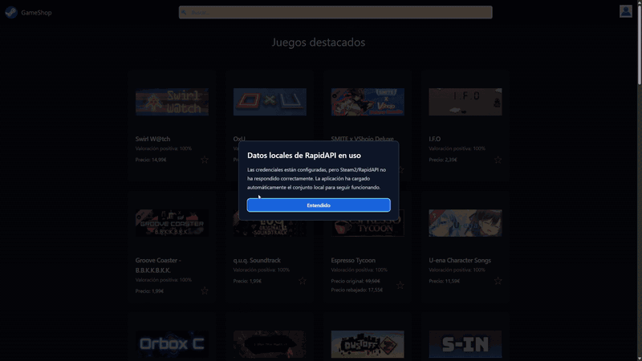

# GameShop — HPE CDS TFG

[](docs/assets/grabacion-funcionamiento.mp4)

[Ver la grabación completa en formato MP4](docs/assets/grabacion-funcionamiento.mp4)

Aplicación de demostración basada en Next.js, Flask, Spring Cloud Eureka/Zuul,
Kafka y MongoDB. El proyecto puede arrancar con Docker Compose tanto con como sin
credenciales externas.

## Arranque rápido

Requisitos: Docker Desktop (o Docker Engine con Compose v2) y los puertos 3000,
4000, 4001, 4002, 8081, 8761, 9093 y 27017 libres.

```powershell
docker compose up --build --detach
docker compose ps --all
```

No es obligatorio crear `.env`. Sin él, Compose utiliza credenciales internas de
desarrollo para MongoDB/JWT, omite Google OAuth y carga 571 juegos desde el JSON
local. Es normal que `injector` aparezca como `Exited (0)`: es un trabajo de
sembrado que termina después de publicar los juegos en Kafka.

Abre:

- Aplicación: http://localhost:3000
- Eureka: http://localhost:8761
- Gateway: http://localhost:8081

El primer arranque puede tardar varios minutos mientras descarga y compila las
imágenes Java, Python y Node. Compose espera automáticamente a que las
dependencias estén saludables.

## Credenciales opcionales

Para personalizar la configuración:

```powershell
Copy-Item .env.example .env
```

Edita `.env` y recrea las imágenes/contenedores para que todas las variables se
vuelvan a leer:

```powershell
docker compose up --build --detach --force-recreate
```

Variables externas:

- `GOOGLE_CLIENT_ID` y `GOOGLE_CLIENT_SECRET`: ambas son necesarias para Google.
- `GOOGLE_CALLBACK_URI`: en desarrollo debe ser exactamente
  `http://localhost:8081/api/login/callback`.
- `RAPIDAPI_KEY`: activa el intento de consulta a Steam2/RapidAPI.
- `RAPIDAPI_HOST`: por defecto `steam2.p.rapidapi.com`.
- `NEXT_PUBLIC_API_BASE_URL`: por defecto `http://localhost:8081/api`; al ser una
  variable pública de Next se incorpora durante el build del frontend.

Orígenes de las credenciales:

- Clientes OAuth de Google: https://console.cloud.google.com/auth/clients
- Pantalla de consentimiento: https://console.cloud.google.com/auth/branding
- API Steam2 en RapidAPI: https://rapidapi.com/psimavel/api/steam2
- Suscripción de Steam2: https://rapidapi.com/psimavel/api/steam2/pricing

En Google configura:

- Origen JavaScript autorizado: `http://localhost:3000`
- URI de redireccionamiento autorizada:
  `http://localhost:8081/api/login/callback`

## Comportamiento sin servicios externos

- Al pulsar Google sin sus dos variables, el backend devuelve un error controlado
  y el frontend muestra un modal centrado con los nombres exactos que faltan.
- Si falta `RAPIDAPI_KEY`, el inyector no realiza ninguna petición externa: carga
  el JSON local y Home muestra el modal de datos locales.
- Si existe la clave pero Steam2/RapidAPI no responde correctamente, también se
  usa el JSON; el modal indica que la credencial existe pero el proveedor no está
  disponible.

El fixture está en
[`Injector/data/rapidapi-steam-games.json`](Injector/data/rapidapi-steam-games.json).
Contiene 571 juegos de la base MongoDB histórica del propio proyecto en el commit
`8042bd0`, generada por el inyector original contra Steam2/RapidAPI en 2023. La
exportación incluyó únicamente la colección pública `juegos`: no contiene
usuarios, claves, secretos ni cabeceras de autorización. En julio de 2026 se
intentó regenerarlo con la clave local del propietario, pero el endpoint publicado
por Steam2 devolvía HTTP 404; por eso se conservó el conjunto histórico real en
lugar de inventar datos.

## Operación

Ver estado y logs:

```powershell
docker compose ps --all
docker compose logs --follow
docker compose logs injector consumidor consumidor-base
```

Detener sin borrar datos:

```powershell
docker compose down
```

Reiniciar desde una base MongoDB vacía (elimina los usuarios y favoritos locales):

```powershell
docker compose down --volumes --remove-orphans
docker compose up --build --detach
```

Más información:

- [Arquitectura](docs/architecture.md)
- [Guion para la demostración](docs/demo-guide.md)
- [Resolución de problemas](docs/troubleshooting.md)
